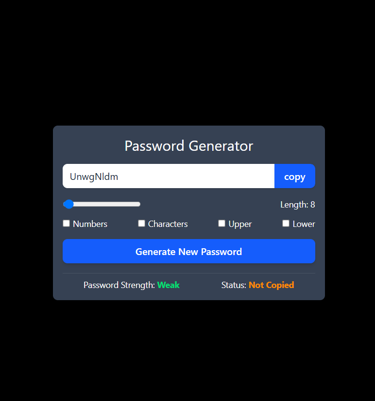

# 🔐 Advanced Password Generator

A sleek, highly interactive, and responsive web-based password generator built with **React**, **Vite**, and **Tailwind CSS**. This application allows users to dynamically configure secure passwords with custom lengths, character parameters, casing rules, and real-time security strength metrics.

---

## ✨ Features

* **Dynamic Customization**: Control password length seamlessly using a modern interactive range slider (6–100 characters).
* **Rule Parameters**: Toggle inclusions for numbers and special special characters (`!@#$%^&*...`).
* **Text-Case Adjustments**: Dynamically transform output casing to strictly **ALL CAPS** (Uppercase) or **all lowercase** with automated toggle protection (mutually exclusive switches).
* **Strength Estimation Indicator**: Evaluates structural patterns on-the-fly and scores the password security level (`Weak`, `Medium`, or `Strong`).
* **One-Click Clipboard copy**: Copies the final displayed password instantly using the modern `globalThis.navigator.clipboard` API with an interactive **2-second green UI confirmation timeout**.

---

## 🛠️ Tech Stack

* **Framework**: [React 18+](https://react.dev/)
* **Build Tool**: [Vite](https://vitejs.dev/) (Optimized HMR & Fast Bundling)
* **Styling Engine**: [Tailwind CSS](https://tailwindcss.com/) (Utility-first configuration)
* **Hooks Used**: `useState`, `useCallback`, `useEffect`, `useRef`

---
## 📸 Preview




## Installation

Clone the repository:

```bash
git clone https://github.com/gawaliabhijeet-cell/passwordGenerator.git
```

Install dependencies:

```bash
npm create vite@latest
```

Start the development server:

```bash
npm run dev
```